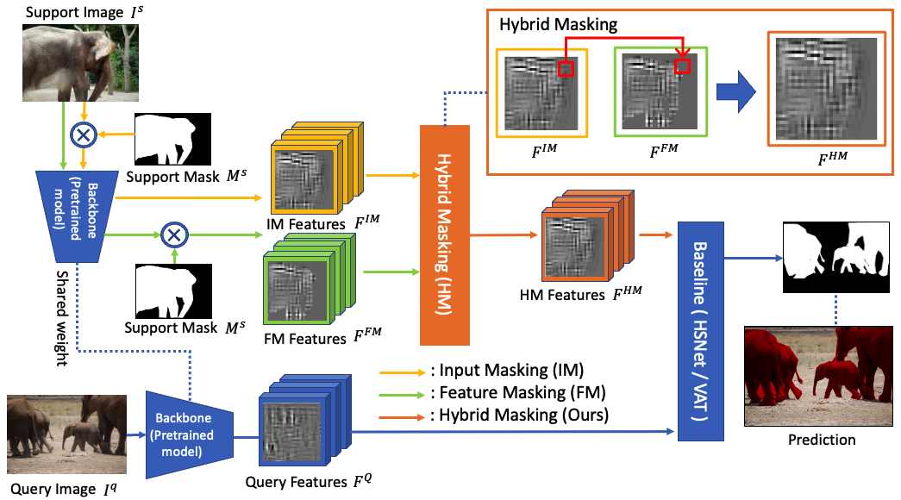
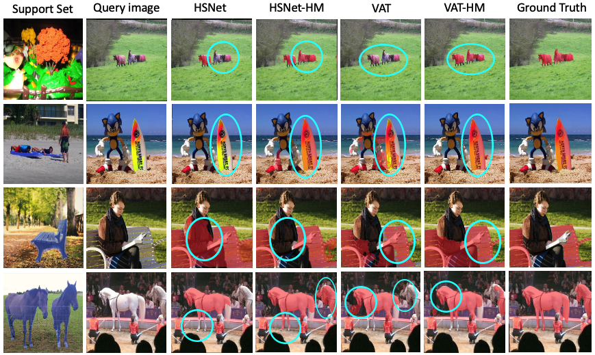

## HM: Hybrid Masking for Few-Shot Segmentation

<p align="middle">
    
</p>


## Scripts
This work can be implemented very easily by using the below script. 
The below script needs to be added to the [HSNet](https://github.com/juhongm999/hsnet), [VAT](https://github.com/Seokju-Cho/Volumetric-Aggregation-Transformer) and [ASNet](https://github.com/dahyun-kang/ifsl).

            supprot_img_im = torch.zeros_like(support_img)            
            supprot_img_im[:,0,:,:]= support_img[:,0,:,:]*support_mask 
            supprot_img_im[:,1,:,:]= support_img[:,1,:,:]*support_mask  
            supprot_img_im[:,2,:,:]= support_img[:,2,:,:]*support_mask  

            Feature_masking = self.extract_feats(support_img, self.backbone, self.feat_ids, self.bottleneck_ids, self.lids)
            Input_masking = self.extract_feats(supprot_img_im, self.backbone, self.feat_ids, self.bottleneck_ids, self.lids)

            Feature_masking = self.mask_feature(Feature_masking, support_mask.clone())

            for i in range(len(Feature_masking)):
                s_r = torch.where(Feature_masking[i]>0, Feature_masking[i],  Input_masking[i] )
                Feature_masking[i] = s_r
                
                
            query_feats = self.resize_feats(query_feats, self.stack_ids)           
            Hybrid_masking = self.resize_feats(Feature_masking, self.stack_ids)


For your convenience, we provide example files for hsnet, vat and asnet.


## Evaluation

Follow the testing direction for each method and use the pretrained models with the above script.

HSNet-HM [Link]
- Pascal-5 Benchmark with ResNet50
- Pascal-5 Benchmark with ResNet101
- COCO-20 Benchmark with ResNet50 [Link](https://drive.google.com/drive/folders/1n6sNZhnDY-plL7cI4DcdXcTzwNYbSJmQ?usp=sharing)
- COCO-20 Benchmark with ResNet101 [Link](https://drive.google.com/drive/folders/1Y7Q25SSxOmfeN3necQJ2xMITCmoCZuGl?usp=sharing)
- FSS-1000 Benchmark with ResNet50
- FSS-1000 Benchmark with ResNet101

VAT-HM [Link]

- Pascal-5 Benchmark with ResNet50 [Link]()
- Pascal-5 Benchmark with ResNet101 [Link]()
- COCO-20 Benchmark with ResNet50 [Link](https://drive.google.com/drive/folders/1U93SBWk0wkJHMwth8ZM19qEqcRwK3BlY?usp=sharing)
- FSS-1000 Benchmark with ResNet50 
- FSS-1000 Benchmark with ResNet101 

ASNet-HM [Link]

- COCO-20 Benchmark with ResNet50 [Link]()
- COCO-20 Benchmark with ResNet101 [Link]()

## Performance


## Visualization

<p align="middle">
    
</p>


## References

Our work is based on these models. (HSNet, VAT, and ASNet)

- [HSNet](https://github.com/juhongm999/hsnet) : Hypercorrelation Squeeze for Few-Shot Segmentation, 2021 ICCV
- [VAT](https://github.com/Seokju-Cho/Volumetric-Aggregation-Transformer) : Cost Aggregation with 4D Convolutional Swin Transformer for Few-Shot Segmentation, ECCV 2022
- [ASNet](https://github.com/dahyun-kang/ifsl) : Integrative Few-Shot Learning for Classification and Segmentation, CVPR 2022

Thank you very much.

### BibTeX
If you find this research useful, please consider citing:

````BibTeX
@article{HMFS,
  title={HM: Hybrid Masking for Few-Shot Segmentation},
  author={Seonghyeon Moon, Samuel S. Sohn, Honglu Zhou, Sejong Yoon, Vladimir Pavlovic, Muhammad Haris Khan, Mubbasir Kapadia},
  journal={arXiv preprint arXiv:2203.12826},
  year={2022}
}
````
